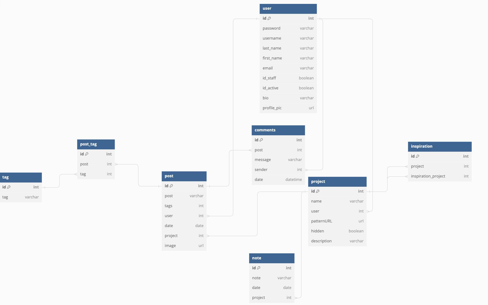

- [Application Overview](#application-overview)
- [Features](#features)
- [Planning](#planning)
- [Technologies Used](#technologies-used)
- [Installation](#installation)
- [Acknowledgements](#acknowledgements)


# Application Overview 
Handmade Hangout is a crafting social media site where crafters can share their projects and get inspiration from what others are making. One exciting feature of this project is the ability for users to autofill their social media posts. This feature makes API calls to OpenAI with information provided by the user and returns a potential social media post. This project was created using Python, Django, JavaScript, React, Material UI, and Cloudinary. You can watch a demo of the site [here](https://www.youtube.com/watch?v=uvoRfew1iaE). 

# Features 
* Users can add projects to their profile using the "Start a new project form" and they can choose whether or not to make the project visible to other users. 
* Users can add private notes to their projects to help remember and keep track of information without making it public to other users.
* Users can make posts about their projects to share them with other. Handmade Hangout integrates with OpenAI and allows users to autofill their posts if they are unsure what to say. 
* Users can add photos to their posts. 

# Planning 
* [ERD](https://dbdiagram.io/d/Full-stack-capstone-647d142f722eb774945f84b8)


# Technologies Used 
* Python
* Django 

# Installation 
1. Clone this repo
2. Establish a virtual environment
   ```pipenv shell```
   ```pipenv install```
3. Run the migrations
```python3 manage.py migrate```
4. Seed the database from the fixtures. It is important to run them in this order. 
   ```python3 manage.py loaddata users```
   ```python3 manage.py loaddata tokens```
   ```python3 manage.py loaddata tags```
   ```python3 manage.py loaddata projects```
   ```python3 manage.py loaddata notes```
   ```python3 manage.py loaddata posts```
5. Instructions for the front end can be found [here](https://github.com/amathews043/Full-Stack-Capstone)


# Acknowledgements
I couldn't have done any of this without all the wonderful people in Cohort 62. Thank you all for all the support and help!